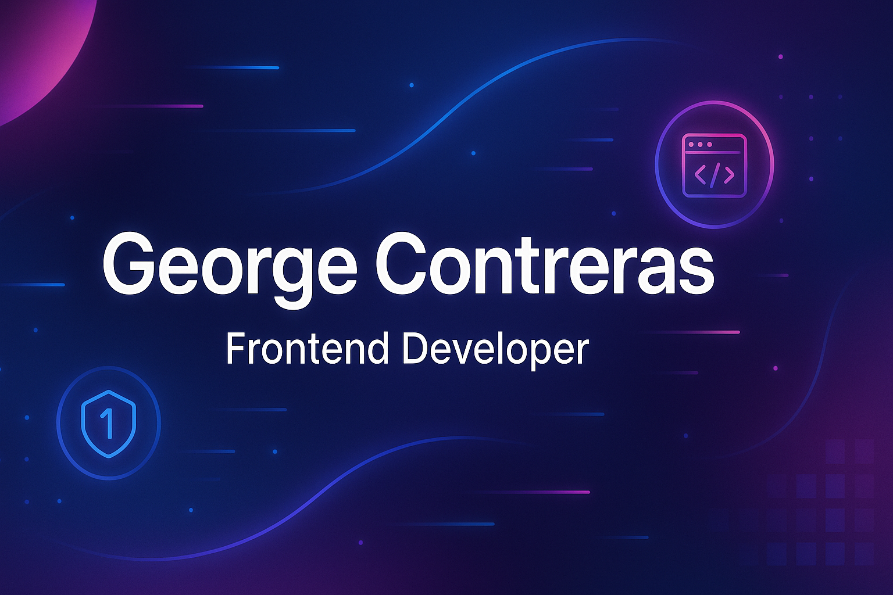

<!-- Banner -->

  

<h1 align="center">👋 Hola, soy George Contreras</h1>
<h3 align="center">Frontend Developer | Apasionado por crear experiencias web modernas</h3>

---

🌐 **Conéctate conmigo**  

 <!-- Actualiza si tienes un dominio -->

---

### 🧠 Sobre mí

- 💻 Soy desarrollador frontend con experiencia en React, Astro y Tailwind CSS.
- 🚀 Me encanta trabajar en proyectos web modernos con enfoque en performance y diseño.
- 🔧 También manejo backend con Express y MongoDB (Stack MERN).

---

### 🛠️ Tecnologías y herramientas

---

### 📊 GitHub Stats

  
   
  

---

### ⚡ Proyectos Destacados

- 🔐 **1Save Password** – Gestor de contraseñas en React y Tailwind.
- 🛒 **Tienda React** – Proyecto de ecommerce usando FakeStoreAPI.
- 🎮 **Photon Prefab Manager** – Sistema personalizado para manejar prefabs en Photon PUN.

---

### 🤝 ¡Hablemos!

Estoy abierto a colaboraciones, freelancing o simplemente charlar sobre tecnología.  
¡Gracias por visitar mi perfil! 😄
